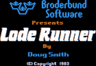

##  retro - Apple II Emulator 

|                                 |                                 |                                             |                                             |
|---------------------------------|---------------------------------|---------------------------------------------|---------------------------------------------|
|  |  |  |  |

### Compatibility

The Retro Apple II Emulator has been developed and tested with:
* `Ubuntu 22 (x86_64)`
* `X11, X.Org version: 1.21.1.4`
* `OpenGL 2.1` compatible graphics drivers (mesa, nvidia)
* `Go 1.21`, `gcc 11.4`

### What's In The Retro Box?
* Board
  * CPU MOS 6502, variable speed (from own [cultivation](https://github.com/dtgorski/m6502))
  * RAM 48KB (+ 16KB Language Card)
  * Applesoft Basic ROM¹
  * Apple Disk II Interface ROM¹
* Display modes (using a 280 x 192 pixel resolution):
  * Default (Text 40 x 24, monochrome)
  * Low Resolution (LoRes 40 x 48, 16 colors)
  * High Resolution (HiRes 140 x 192, 6/8 colors)
  * Mixed (in all modes, the lower 32 pixel rows show four lines of monochrome Text)
* Cards in slots
  * #0: Language Card (16KB RAM, banked)
  * #6: Apple Disk II interface with two diskette drives (16 sector)
* Implementation specific
  * ```CTRL-SHIFT-R``` triggers a reset
  * ```CTRL-V``` pastes the clipboard content
  * persistent configuration, especially convenient for color calibration
  * the source code - if you are interested - is fairly easy to comprehend

¹ included for educational purposes, not owned or licensed by this project

### What Is Missing?
* Speaker sound, in the first place
* Creating and writing of disk images
* Double HiRes and 80x24 character resolution

### Configuration
A configuration file `retro.config.yml` exists in the project directory and is distributed
along with the `retro` executable binary.

### Download

The releases are listed on the right side. It is recommended to use the latest release, especially when
you want to report issues. 

### Build And Run

A Go compiler is required. The code is a CGO application, that is, a Go program with linked C libraries.
Hence before you `make build` or `make run`, following non-Go packages must be additionally installed on your system:

```sh
$ sudo apt install  \
    libxi-dev       \
    libglx-dev      \
    libgl-dev       \
    libx11-dev      \
    libxrandr-dev   \
    libxcursor-dev  \
    libxinerama-dev \
    libxxf86vm-dev  \
    pkg-config      \
    make            \
    gcc
```  
Then ...
```sh
$ git clone https://github.com/dtgorski/retro.git    
$ cd retro && make run # see @dev below    
```
**The first build (when Go builds up caches) might take a bit longer as usual.**

### Usage

```
$ retro -h

Usage: retro [options]
Retro Apple II Emulator v0.0.0

The default name of the configuration file is "retro.config.yml".
At program start, following configuration locations are checked:
first the directory, where the executable resides; then outside,
in ~/.config/retro/, /usr/local/etc/retro/, and /etc/retro/

When no disk image is provided (with -1), the emulator will boot
into the Applesoft BASIC prompt. Additionally, the ROM(s) of the
virtual Apple Disk II Interface will not be mounted into memory.

Command line options override their configuration counterparts. 

Options:
    -1 <path/to/image>
         The APPLE DISK II .dsk image to insert into Drive 1.
         Path can be a HTTP URL. Fetched images are not saved.
    
    -2 <path/to/image>
         The APPLE DISK II .dsk image to insert into Drive 2.
         Path can be a HTTP URL. Fetched images are not saved.

    -c <path/to/config>
         Path to an alternative configuration file. 

    -m <cpu-clock-in-mhz>
         MHz speed of the CPU clock. Usual clock settings are
         0.98 (1MHz) and 3.58 (4MHz). The first is the default.

    -z <window-zoom [1..n]>
         Window magnification. A zoom factor of 1 is equivalent
         to the Apple II native resolution of 280 x 192 pixels.
         Default value: 3 

More options:
    -h  Display this usage help and exit.
    -v  Print program version and exit.
```

### Apple II Diskette Images
Supported formats for disk images:
* Apple II DSK 16 Sector format (`.dsk`, usually 140KB in size)

You can find these images by searching the Web for: `apple ii dsk download`.
Please be aware that these images may be subject to copyright restrictions.

```
$ wget https://<...>/Name.dsk
$ retro -1 Name.dsk
```
...or...
```
$ retro -1 https://<...>/Name.dsk
```

### @dev
Try ```make```:
```
$ make

 make help           Displays this list
 make clean          Removes build/test artifacts
 make dist-clean     Removes Go caches and artefacts debris
 make build          Builds executable binary
 make run            Runs the application
 make tidy           Formats source files, cleans go.mod
```

### Internal Structure Overview
```
├── context
│   └── Context interface {
│           Deadline() (deadline time.Time, ok bool)
│           Done() <-chan struct {}
│           Err() error
│           Value(key interface {}) interface {}
│       }
├── error interface {
│       Error() string
│   }
├── io
│   └── Reader interface {
│           Read(p []byte) (n int, err error)
│       }
├── retro
│   ├── emu
│   │   ├── device
│   │   │   ├── builtin
│   │   │   │   ├── Keyboard struct {}
│   │   │   │   └── Paddles struct {}
│   │   │   ├── diskette
│   │   │   │   ├── Card struct {}
│   │   │   │   ├── Decoder struct {}
│   │   │   │   ├── Drive struct {}
│   │   │   │   ├── Encoder struct {}
│   │   │   │   ├── Image struct {}
│   │   │   │   ├── Reader interface {
│   │   │   │   │       Read() byte
│   │   │   │   │   }
│   │   │   │   ├── Track struct {}
│   │   │   │   └── TrackReader struct {}
│   │   │   ├── language
│   │   │   │   └── Card struct {}
│   │   │   └── render
│   │   │       ├── Driver struct {}
│   │   │       ├── Font struct {}
│   │   │       ├── HiRes struct {}
│   │   │       ├── LoRes struct {}
│   │   │       ├── Mode byte
│   │   │       ├── Modes map[render.Mode]render.Renderer
│   │   │       ├── Renderer interface {
│   │   │       │       Render(page byte, canvas []byte, flash bool)
│   │   │       │   }
│   │   │       └── Text struct {}
│   │   ├── input
│   │   │   ├── CursorPos struct {}
│   │   │   ├── KeyInput struct {}
│   │   │   ├── KeyMap struct {}
│   │   │   └── MouseButton struct {}
│   │   ├── memory
│   │   │   ├── Bus interface {
│   │   │   │       Read(lo byte, hi byte) byte
│   │   │   │       Write(lo byte, hi byte, b byte)
│   │   │   │   }
│   │   │   ├── DMA interface {
│   │   │   │       DMA() []byte
│   │   │   │   }
│   │   │   ├── Device interface {
│   │   │   │       Read(lo byte, hi byte) (byte, bool)
│   │   │   │       Reset()
│   │   │   │       Slot(num byte)
│   │   │   │       Write(lo byte, hi byte, b byte) bool
│   │   │   │   }
│   │   │   ├── Manager struct {}
│   │   │   └── Memory interface {
│   │   │           memory.Bus
│   │   │           memory.DMA
│   │   │           DMA() []byte
│   │   │           Load(addr uint16, r io.Reader) error
│   │   │           MustLoad(addr uint16, r io.Reader)
│   │   │           Read(lo byte, hi byte) byte
│   │   │           Write(lo byte, hi byte, b byte)
│   │   │       }
│   │   └── virtual
│   │       ├── Bridge struct {}
│   │       ├── CPU interface {
│   │       │       PC(lo byte, hi byte)
│   │       │       PCH() byte
│   │       │       PCL() byte
│   │       │       Reset()
│   │       │       Step() (cycles uint, err error)
│   │       │   }
│   │       ├── Channels struct {}
│   │       └── Machine struct {}
│   └── gui
│       ├── Properties struct {
│       │       Width int
│       │       Height int
│       │       Title string
│       │   }
│       └── Window struct {}
└── time
    └── Time struct {}
```

---

### A Personal Note
> *"As many others of my generation, I have started my computer career in 1983 with an Apple II machine.
> Those early days were filled with the excitement of exploration and discovery, as I marveled at
> the possibilities that this revolutionary piece of technology offered.*
>
> *Now, after four decades, I embark on a nostalgic journey, choosing to revisit and relive the memories
> the memories of my youth with an Apple II emulator, that not only resurrects the classic experience,
> but also pays homage to the era that sparked my passion for computing.*
>
> *I hope this emulator brings back fond memories for you as it has for me."*
>
> -- Daniel T. Gorski, author
 
### License
[MIT](https://opensource.org/licenses/MIT) - © dtg [at] lengo [dot] org
